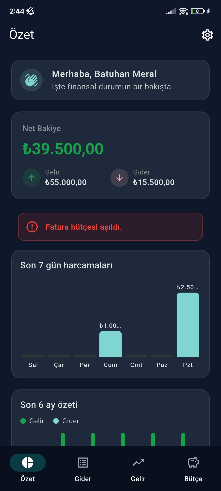
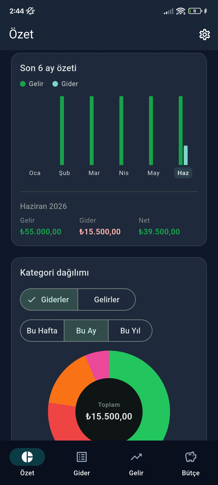
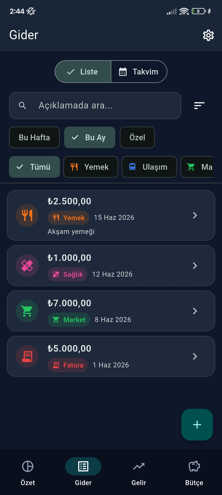

# Balancio

> Offline-first, multi-user personal finance app for tracking expenses, income, and monthly budgets. Built with Flutter and SQLite.

Balancio is a personal finance app that helps you record where your money goes and comes from, set monthly budget limits, and review your spending habits at a glance. All data stays on the device, passwords are hashed, and the app works fully offline.

## Features

- **Expenses & income** — full add/edit/delete with categories, sources, notes, and dates.
- **Search & filter** — note search, category/source filters, date ranges, sorting, and a calendar view.
- **Bulk actions** — multi-select expenses to batch delete or recategorize.
- **Recurring transactions** — monthly templates for expenses and income, with automatic backfill for missed months.
- **Budgets** — per-category monthly limits with a 90% warning and over-limit alert.
- **Dashboard** — net balance, category breakdowns, six-month and seven-day charts, and recent activity, all hand-drawn with `CustomPainter`.
- **Accounts & security** — salt + SHA-256 hashing, brute-force lockout, password recovery, and cascading account deletion.
- **Profile** — avatar from camera/gallery, editable username and full name.
- **Themes & languages** — light/dark/system theme, instant TR ↔ EN switching, and currency selection, all persisted.

## Tech Stack

| Layer | Technologies |
| --- | --- |
| **Language & SDK** | Dart (≥ 3.11), Flutter (stable) |
| **UI** | Material 3, `StatefulWidget` + `setState`, custom `CustomPainter` charts |
| **Persistence** | `sqflite`, `shared_preferences`, `path` / `path_provider` |
| **Security** | `crypto` (per-user salt + SHA-256), enforced foreign keys, per-user isolation |
| **Localization** | `flutter_localizations`, `intl` (TR/EN) |
| **Media** | `image_picker` |
| **Tooling** | `flutter_lints`, `flutter_test`, `sqflite_common_ffi` |

## Installation

Requires Flutter **stable** (Dart ≥ 3.11).

```bash
git clone https://github.com/batuhanmeral/Balancio.git
cd Balancio
flutter pub get
flutter run
```

For a release build, use `flutter build apk` (Android) or `flutter build ios` (iOS).

### Project structure

```
lib/
├── app/         # theme, routes, constants, controllers
├── l10n/        # AppL10n base + TR/EN implementations
├── models/      # User, Expense, Income, Budget, CustomCategory, Recurring*
├── services/    # database, auth, password hasher, repositories, recurring runners
├── screens/     # auth, home, dashboard, expenses, income, budget, recurring, settings, onboarding
├── widgets/     # shared UI: chips, tiles, charts, banners, dialogs
└── utils/       # validators, formatters, date/money utils
```

### Development

```bash
flutter analyze
flutter test
```

## Screenshots

<p align="center">
  
  <br />
  <em>Overview — net balance, charts, and recent activity</em>
</p>
<p align="center">
  
  <br />
  <em>Income — income entries with sources and filters</em>
</p>
<p align="center">
  
  <br />
  <em>Expenses — expense list with categories and search</em>
</p>

## License

This project is licensed under the [MIT License](LICENSE). © 2026 Batuhan Meral.